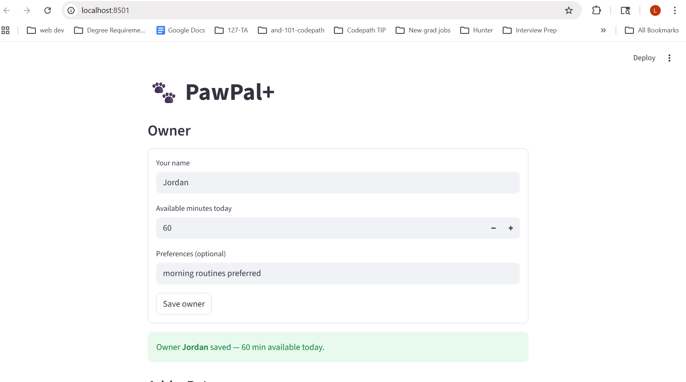

# PawPal+ (Module 2 Project)

**PawPal+** is an intelligent pet care scheduler built with Python and Streamlit. It helps busy pet owners plan daily care tasks across multiple pets — factoring in time budgets, task priorities, recurring schedules, and time-slot conflicts.

---

## 📸 Demo


---

## Features

### Core scheduling
- **Priority-based planning** — Tasks are ranked `high → medium → low`. The scheduler greedily selects the highest-priority tasks that fit within the owner's available time budget for the day.
- **Time budget enforcement** — Any task whose duration would push the total over `available_minutes` is automatically skipped and listed in a "Skipped tasks" section.
- **Plan explanation** — After generating a schedule, the app explains how many tasks were selected, how much time they use, and which tasks were left out and why.

### Sorting
- **Sort by scheduled time** — Tasks are displayed in chronological `HH:MM` order using a lambda key on the time string. Because `"HH:MM"` strings sort lexicographically the same way they sort chronologically, no date parsing is required. Tasks without a set time always sort to the end.
- **Sort by duration** — Tasks can also be ordered shortest-to-longest (or reversed), useful for seeing quick wins first.

### Filtering
- **Filter by pet** — View only the tasks assigned to a specific pet, making it easy to review one animal's workload at a time.
- **Filter by status** — Narrow the task list to `Pending` or `Done` tasks to track what still needs to happen today.

### Recurring tasks
- **Daily and weekly recurrence** — Each task carries a `recur_days` field (`0` = one-time, `1` = daily, `7` = weekly, etc.).
- **Auto-spawn on completion** — When `mark_task_complete()` is called on a recurring task, a fresh copy is automatically created with `due_date = today + timedelta(days=recur_days)` and registered back on the pet and scheduler pool. Recurring care never silently falls off the list.

### Conflict detection
- **Time-slot collision warnings** — `check_time_conflicts()` groups all pending tasks by their `scheduled_time`. If two or more tasks share the same slot (same pet or different pets), a plain-text warning is returned instead of raising an exception, so the app stays running and shows the owner exactly which tasks conflict and at what time.
- **Duplicate title detection** — The scheduler also flags if the same task title is queued more than once for the same pet on the same day.
- **Over-budget task warning** — Any individual task whose duration alone exceeds the total available time is flagged explicitly.

---

## Scenario

A busy pet owner needs help staying consistent with pet care. They want an assistant that can:

- Track pet care tasks (walks, feeding, meds, enrichment, grooming, etc.)
- Consider constraints (time available, priority, owner preferences)
- Produce a daily plan and explain why it chose that plan

Your job is to design the system first (UML), then implement the logic in Python, then connect it to the Streamlit UI.

## What you will build

Your final app should:

- Let a user enter basic owner + pet info
- Let a user add/edit tasks (duration + priority at minimum)
- Generate a daily schedule/plan based on constraints and priorities
- Display the plan clearly (and ideally explain the reasoning)
- Include tests for the most important scheduling behaviors

## Getting started

### Setup

```bash
python -m venv .venv
source .venv/bin/activate  # Windows: .venv\Scripts\activate
pip install -r requirements.txt
```

### Suggested workflow

1. Read the scenario carefully and identify requirements and edge cases.
2. Draft a UML diagram (classes, attributes, methods, relationships).
3. Convert UML into Python class stubs (no logic yet).
4. Implement scheduling logic in small increments.
5. Add tests to verify key behaviors.
6. Connect your logic to the Streamlit UI in `app.py`.
7. Refine UML so it matches what you actually built.

## Testing PawPal+

Run the full test suite from the project root:

```bash
python -m pytest
```

### What the tests cover

| Area | Tests | What is verified |
|---|---|---|
| **Task basics** | 3 | `mark_complete` flips status; `add_task` grows the list; pet name is stamped on each task |
| **Sorting** | 3 | Tasks sort chronologically by `"HH:MM"` time; tasks without a time sort last; `sort_by_duration` orders correctly |
| **Recurrence** | 5 | `next_occurrence` advances `due_date` by `recur_days`; weekly tasks advance by 7; one-time tasks raise `ValueError`; `mark_task_complete` spawns a new task on both the pet and scheduler; one-time completion returns `None` |
| **Conflict detection** | 3 | Same-pet time collision is flagged; cross-pet collision is flagged; different time slots produce no warning |
| **Edge cases** | 4 | Empty task list generates an empty plan; tasks exceeding the time budget are skipped; completed tasks are excluded from `get_pending_tasks`; `filter_by_pet` returns only the matching pet's tasks |

### Confidence level

★★★★☆ (4 / 5)

All 18 tests pass. The happy paths and most common edge cases are covered. The remaining gap is duration-based overlap detection — the conflict checker only flags exact time-slot matches, not cases where one task's duration runs into the next task's start time. That would require additional tests (and logic) to fully verify.

---

## Smarter Scheduling

Beyond the basic priority-and-time-budget plan, the scheduler includes four additional algorithms:

**Sort by scheduled time**
`Scheduler.sort_by_time(tasks)` orders any list of tasks chronologically using a lambda key on each task's `scheduled_time` string (`"HH:MM"`). Because ISO-formatted time strings compare lexicographically in the same order they compare chronologically, no date parsing is needed. Tasks without a time set sort to the end.

**Filter by pet or completion status**
`Scheduler.filter_by_pet(pet_name)` and `Scheduler.filter_by_status(completed)` return a filtered view of the task pool using a single list comprehension. These make it easy to display only one pet's workload or show only what still needs to be done.

**Recurring task auto-spawn**
Every `Task` carries a `recur_days` field (0 = one-time). When `Scheduler.mark_task_complete(task, pet)` is called on a recurring task, it calls `task.next_occurrence()` to create a fresh copy whose `due_date` is advanced by `timedelta(days=recur_days)`. The new task is registered on the pet and added back into the scheduler's pool automatically, so recurring care (daily walks, weekly litter changes) never falls off the list.

**Time-slot conflict detection**
`Scheduler.check_time_conflicts()` scans all pending tasks and groups them by `scheduled_time`. Any slot occupied by two or more tasks produces a plain-text warning (e.g., `[TIME CONFLICT] 07:00 has 3 overlapping tasks: ...`). The check returns a list of strings rather than raising an exception, so the app can display warnings without crashing. The same check runs automatically inside `generate_plan()` and appears in `DailyPlan.get_summary()`.
